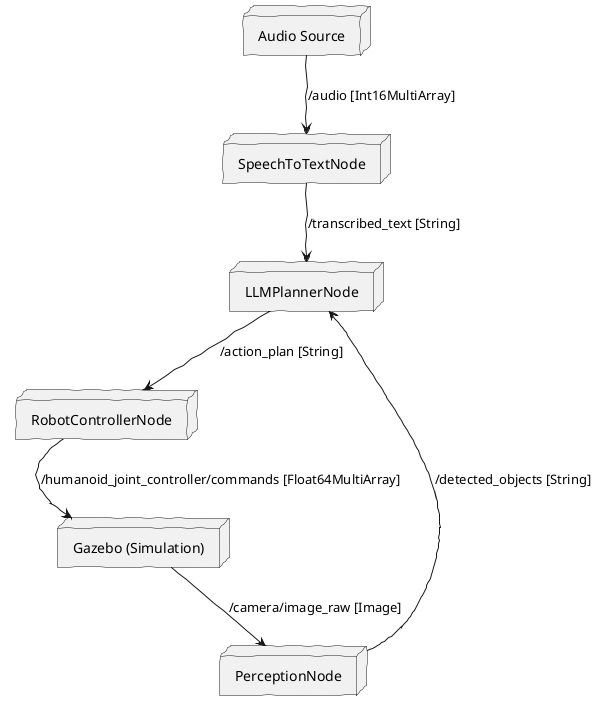

# Chapter 3: The Autonomous Humanoid VLA Pipeline

This final chapter brings together all the components developed in the previous chapters to create a fully autonomous Vision-Language-Action (VLA) pipeline for a humanoid robot. We will integrate visual perception with our LLM-based planner and robot controller, enabling the robot to respond intelligently to spoken commands and interact with its environment.

## High-Level VLA Architecture

The overall architecture of our Vision-Language-Action system can be visualized as follows:

```plantuml
@startuml
skinparam handwritten true

actor "User" as user
box "ROS 2 System" #LightBlue
  [Speech Input] as speech_in
  [Speech-to-Text Node (Whisper)] as stt_node
  [LLM Planner Node (GPT-4)] as llm_planner
  [Perception Node] as perception
  [Robot Controller Node] as robot_ctrl
  [Simulation Environment (Gazebo)] as sim_env
end box

user --> speech_in : Spoken Command
speech_in --> stt_node : Audio Data
stt_node --> llm_planner : Transcribed Text
sim_env <--> perception : Camera Feed / Object State
perception --> llm_planner : Detected Objects
llm_planner --> robot_ctrl : Action Plan (JSON)
robot_ctrl --> sim_env : Robot Commands (Joint Positions / Actions)
sim_env --> user : Visual Feedback

@enduml
```

## Integrating Perception into the VLA Pipeline

The ability to perceive the environment is crucial for any autonomous agent. Our `perception_node.py` acts as the robot's "eyes," detecting objects in the simulated Gazebo world and feeding this information to the LLM planner.

### `perception_node.py` Code

```python
import rclpy
from rclpy.node import Node
from sensor_msgs.msg import Image
from std_msgs.msg import String
from cv_bridge import CvBridge
import cv2
import numpy as np
import json

class PerceptionNode(Node):
    def __init__(self):
        super().__init__('perception_node')
        self.subscription = self.create_subscription(
            Image,
            '/camera/image_raw',  # Assuming camera publishes to this topic
            self.image_callback,
            10)
        self.publisher = self.create_publisher(String, 'detected_objects', 10)
        self.bridge = CvBridge()
        self.get_logger().info('Perception node started, looking for red blocks.')

    def image_callback(self, msg):
        try:
            cv_image = self.bridge.imgmsg_to_cv2(msg, "bgr8")
        except Exception as e:
            self.get_logger().error(f"CvBridge error: {e}")
            return

        # Convert BGR to HSV and detect red objects
        hsv = cv2.cvtColor(cv_image, cv2.COLOR_BGR2HSV)
        lower_red1 = np.array([0, 120, 70])
        upper_red1 = np.array([10, 255, 255])
        lower_red2 = np.array([170, 120, 70])
        upper_red2 = np.array([180, 255, 255])

        mask1 = cv2.inRange(hsv, lower_red1, upper_red1)
        mask2 = cv2.inRange(hsv, lower_red2, upper_red2)
        red_mask = mask1 + mask2

        contours, _ = cv2.findContours(red_mask, cv2.RETR_EXTERNAL, cv2.CHAIN_APPROX_SIMPLE)

        detected_objects = []
        for contour in contours:
            area = cv2.contourArea(contour)
            if area > 100:  # Filter small areas
                x, y, w, h = cv2.boundingRect(contour)
                
                # Simplified 3D position estimation (for demonstration)
                estimated_depth = 1.0 
                object_x_cam = (x + w/2 - cv_image.shape[1]/2) * 0.001 * estimated_depth
                object_y_cam = (y + h/2 - cv_image.shape[0]/2) * 0.001 * estimated_depth 
                
                object_info = {
                    "object_id": f"red_block_{len(detected_objects)}",
                    "label": "red block",
                    "pose": {
                        "x": estimated_depth,
                        "y": -object_x_cam,
                        "z": -object_y_cam
                    },
                    "bounding_box": {"x": x, "y": y, "w": w, "h": h}
                }
                detected_objects.append(object_info)

        if detected_objects:
            detection_msg = String()
            detection_msg.data = json.dumps(detected_objects)
            self.publisher.publish(detection_msg)

# ... (main function) 
```

## Enhancing the LLM Planner with Visual Context

The `llm_planner_node.py` was extended to subscribe to the `detected_objects` topic. This allows the GPT-4 model to receive real-time information about the environment, enabling it to make more informed planning decisions.

### `llm_planner_node.py` Updates

```python
# ... (imports and __init__ function)

class LLMPlannerNode(Node):
    def __init__(self):
        super().__init__('llm_planner_node')
        # ... (transcribed_text subscription and action_plan publisher)
        self.perception_subscription = self.create_subscription(
            String,
            'detected_objects',
            self.detected_objects_callback,
            10)
        self.get_logger().info('LLM planner node started')
        self.detected_objects = [] # Store latest detected objects

    def detected_objects_callback(self, msg):
        try:
            self.detected_objects = json.loads(msg.data)
            self.get_logger().info(f"Received detected objects: {self.detected_objects}")
        except json.JSONDecodeError as e:
            self.get_logger().error(f"Failed to parse detected objects: {e}")

    def transcribed_text_callback(self, msg): # Renamed from listener_callback
        command = msg.data
        # ... (logging, try-except block)

        # Prepare detected objects for the prompt
        objects_info = ""
        if self.detected_objects:
            objects_info = "Currently detected objects in view:\n"
            for obj in self.detected_objects:
                objects_info += f"- {obj['label']} (ID: {obj['object_id']}) at estimated camera-relative position (x:{obj['pose']['x']:.2f}, y:{obj['pose']['y']:.2f}, z:{obj['pose']['z']:.2f})\n"
        
        # ... (structured prompt creation with objects_info)
        # ... (OpenAI API call and plan publishing)
```

## Expanding Robot Control with Manipulation

The `robot_controller_node.py` was updated to include a `pick_up` action, allowing the robot to interact with objects identified by the perception system.

### `robot_controller_node.py` Updates

```python
# ... (imports and __init__ function)

class RobotControllerNode(Node):
    # ... (listener_callback function)

    def execute_task(self, action_name, parameters):
        if action_name == "wave_hello":
            self.wave_hello()
        elif action_name == "walk_forward":
            self.walk_forward()
        elif action_name == "pick_up":
            object_id = parameters.get('object_id')
            self.pick_up(object_id)
        else:
            self.get_logger().warn(f"Unknown action: {action_name}")

    def pick_up(self, object_id):
        self.get_logger().info(f"Executing: pick up {object_id} (placeholder)")
        # A real implementation would involve inverse kinematics, gripper control,
        # and physics simulation interactions to attach/detach objects.

    # ... (wave_hello, walk_forward methods and main function)
```

## The Capstone: Autonomous VLA Pipeline


By combining these enhanced components, our humanoid robot can now perform complex tasks autonomously:


1.  **Voice Command**: User speaks a high-level command (e.g., "Pick up the red block").

2.  **Speech-to-Text**: `speech_to_text_node` transcribes it to text.

3.  **Perception**: `perception_node` continuously detects objects in the environment.

4.  **Cognitive Planning**: `llm_planner_node` receives the text command and object information, then generates a detailed action plan (e.g., `navigate_to`, `find_object`, `pick_up`) using GPT-4.

5.  **Robot Control**: `robot_controller_node` executes the action plan sequentially, controlling the simulated robot's movements and manipulations.


This capstone project demonstrates a powerful paradigm for human-robot interaction, where robots can understand and act upon abstract goals in dynamic environments.


### ROS 2 Node Graph


The complete ROS 2 graph for the VLA pipeline looks like this:



